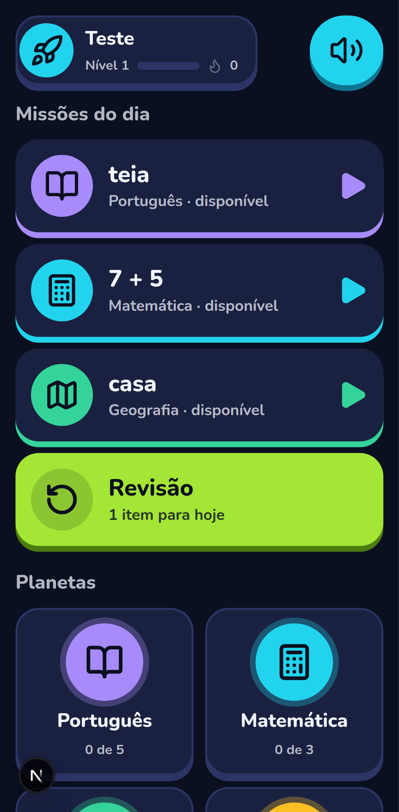
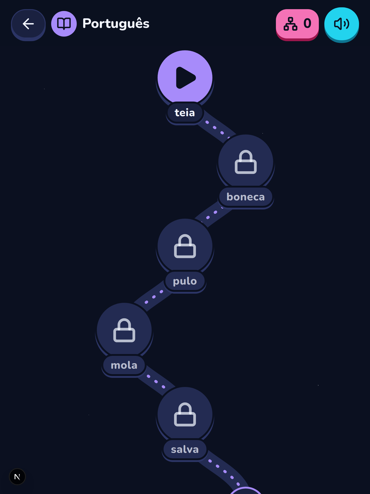
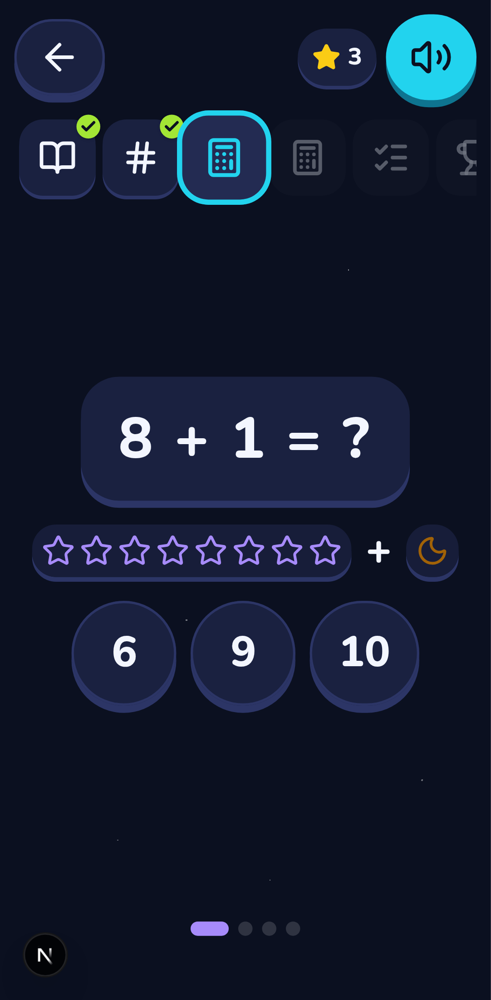
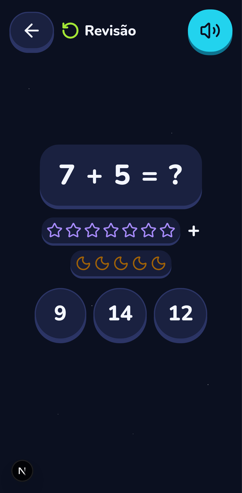
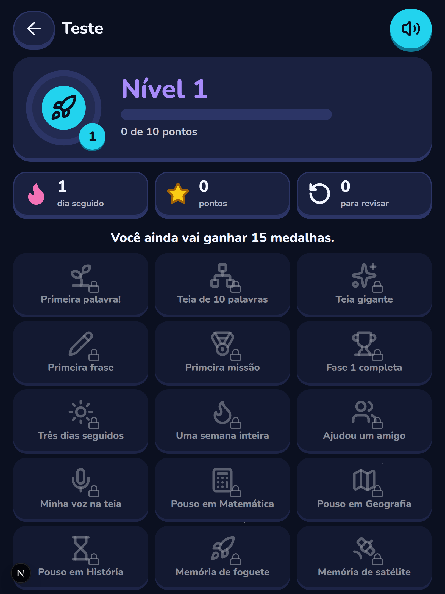
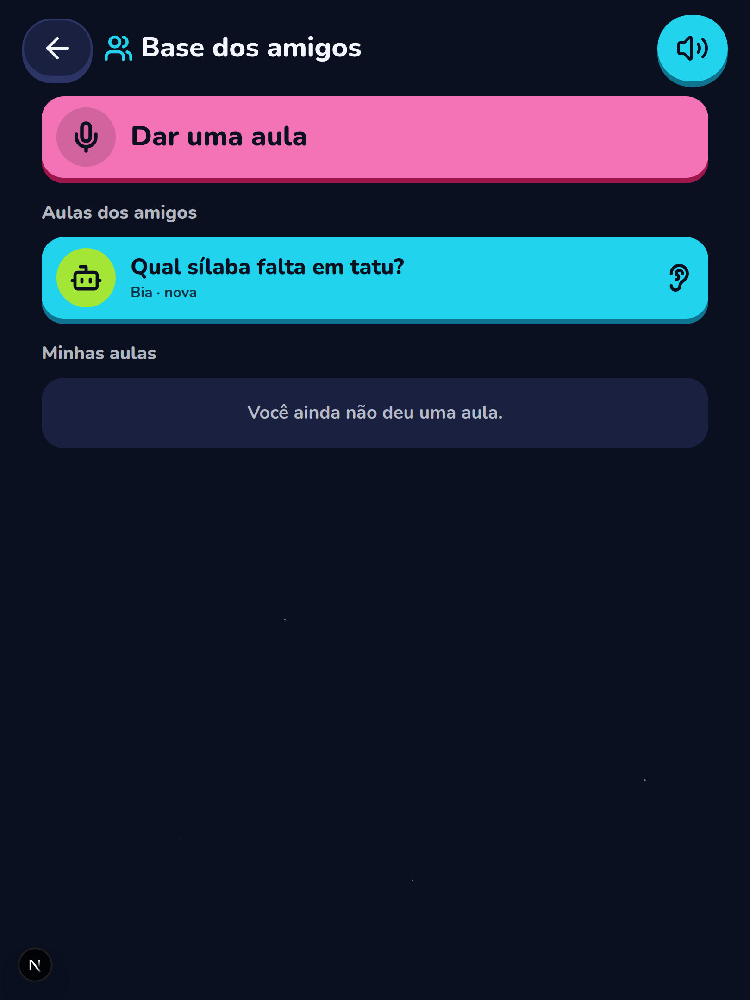
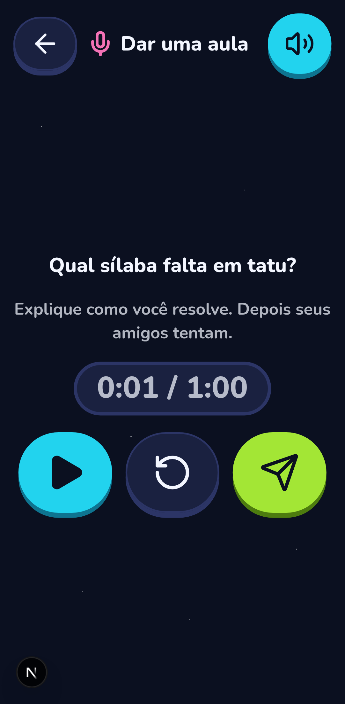
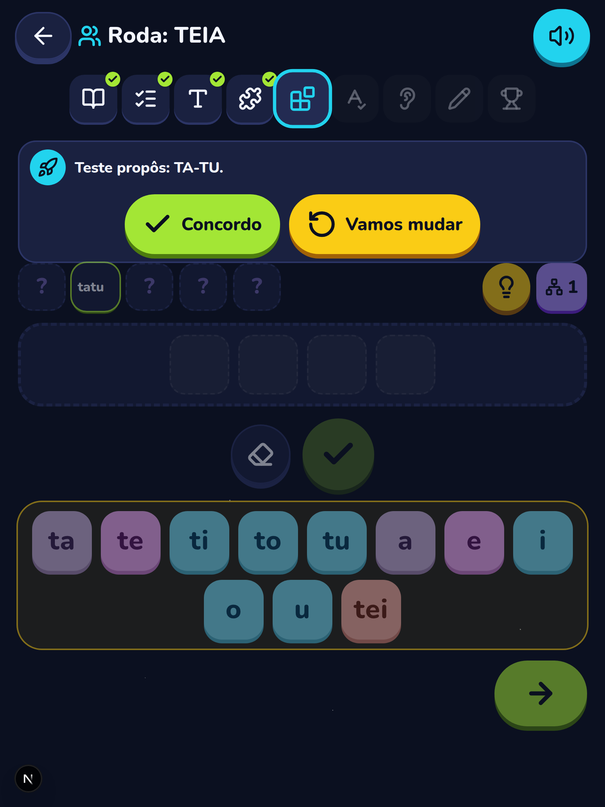

<div align="center">

# Teia de Palavras

**Um portal gratuito e de código aberto para crianças a partir do 1º ano (6+) aprenderem brincando: Português, Matemática, Geografia e História, em missões pela Galáxia.**

Cada missão é uma aventura da nave Teia. Cada palavra descoberta vira um fio na teia da criança.

[](https://github.com/lucsghilardi/teia-de-palavras/actions/workflows/ci.yml)




</div>

---

## Por que este projeto existe

Comecei a Teia de Palavras para ajudar o meu filho a aprender a ler, partindo do
método de Paulo Freire: uma palavra que faz sentido para a criança, os pedaços dela,
e a descoberta de que dá para formar palavras novas. Ele cresceu, e o app cresceu
junto: hoje é uma plataforma de missões a partir do 1º ano (6+), com quatro "planetas"
(Português, Matemática, Geografia e História), revisão espaçada e feedback de jogo
sem nota nem ranking. Como no 1º ano a criança ainda está aprendendo a ler, tudo
o que ela precisa escolher também é falado.

Deixei o código aberto porque muitas famílias, professoras e professores estão
na mesma luta. Se ajudar mais uma criança, já valeu.

## Como funciona

**A Galáxia** é o início: até três *missões do dia* (uma por planeta, o planeta
parado há mais tempo primeiro), a *Revisão* com os itens que venceram, os quatro
planetas com o progresso, a *base dos amigos* e, quando um adulto abre uma, a *Roda*.

**Cada planeta** é uma trilha de missões. **Cada missão** tem de 3 a 7 atividades
curtas, com instrução visível e alto-falante em toda tela, e termina numa
conquista com pontos, itens novos e medalhas.

| Planeta | O que a criança faz | BNCC (1º ano) |
|---|---|---|
| **Português** | História, perguntas de compreensão, palavra geradora, ficha de famílias silábicas, montar palavras, escolher a sílaba que falta, ditado (ouvir e montar), escrever uma frase | EF01LP08 |
| **Matemática** | Juntar e tirar até 10 com objetos na tela, contar até 100 em grupos de 10, dezenas e unidades, ordenar números, pagar com moedas e notas até 10 reais | EF01MA04, 07, 08, 19 |
| **Geografia** | Casa e rua, vizinhos, achar lugares num mapa visto de cima, pontos de referência, direita e esquerda, campo e cidade | EF01GE01, 07, 08, 09 |
| **História** | Ontem, hoje e amanhã, a própria linha do tempo, família, quem faz o quê na comunidade | EF01HI01, 02, 06 |

Três combinados que o sistema nunca quebra:

- **Nada de "errado", nota ou ranking.** Na primeira tentativa que não dá certo a criança ganha uma dica; na segunda, vê a resposta e o item vai para a Revisão. Pontos, nível e medalhas são só dela.
- **Tudo fala.** Cada toque tem áudio: gravação aprovada, áudio da aula, a voz neural (Google TTS, quando configurada; cada frase gerada uma vez e guardada) ou a voz do navegador em português. A narração automática é opcional por criança.
- **Privacidade da criança em primeiro lugar.** Ela tem só apelido, avatar e turma (mais em [Privacidade](#privacidade-e-lgpd)).

<table>
  <tr>
    <td align="center"><br><sub>Planeta Português</sub></td>
    <td align="center"><br><sub>A história</sub></td>
    <td align="center"><br><sub>Montar palavras</sub></td>
  </tr>
  <tr>
    <td align="center"><br><sub>Matemática</sub></td>
    <td align="center"><br><sub>Revisão espaçada</sub></td>
    <td align="center"><br><sub>Nível e medalhas</sub></td>
  </tr>
  <tr>
    <td align="center"><br><sub>Base dos amigos</sub></td>
    <td align="center"><br><sub>Dar uma aula</sub></td>
    <td align="center"><br><sub>Roda em dupla</sub></td>
  </tr>
</table>

**Aprender ensinando.** Na *base dos amigos* a criança grava uma **mini-aula** (a voz dela
explicando um desafio gerado da missão; ela nunca digita) que um adulto ouve e aprova antes
de chegar aos amigos da turma e das *turmas amigas* (a casa de um primo, ligada por um código
que os dois responsáveis aceitam). Quem recebe ouve, responde e reage com um toque. Na **Roda**,
o adulto conduz uma missão ao vivo e as crianças, em duplas, propõem e confirmam as respostas.

Os métodos por trás de cada decisão (palavras geradoras, prática de recuperação e
espaçamento, feedback formativo, maestria, concreto → pictórico → abstrato,
autodeterminação, aprender ensinando) estão em [`docs/metodos.md`](docs/metodos.md).

### Missões que já vêm prontas

O seed traz 10 missões de Português (5 publicadas, 5 em rascunho para o educador
revisar), 4 de Matemática, 4 de Geografia e 4 de História. Os nomes do capitão e
da base são configuráveis, e as histórias se adaptam a eles.

| Português | Matemática | Geografia | História |
|---|---|---|---|
| A nave Teia: **TEIA** | Somar para decolar (4 + 3) | Minha casa e minha rua | Ontem, hoje, amanhã |
| A boneca-robô: **BONECA** | Contar até 100 | O mapa do bairro | Minha linha do tempo |
| O pulo na lua: **PULO** | Dezenas e unidades | Caminhos e referências | Minha família |
| A mola do robô: **MOLA** | Loja espacial | Campo e cidade | Trabalhos da comunidade |
| Juntos salvamos a vila: **SALVA** | | | |
| + 5 missões da Fase 2 (rascunho) | | | |

Conteúdo é dado, não código: cada atividade é um JSON validado pelo backend
([`docs/atividades.md`](docs/atividades.md)), editável no painel (com formulário para os
tipos mais comuns). Tipos hoje: `historia`, `escolha`, `verdadeiro_falso`, `ordenar`,
`linha_do_tempo`, `parear`, `contar`, `somar_subtrair`, `dinheiro`, `mapa_pontos`,
`escolher_silaba`, `ditado` e os de Português (`palavra`, `ficha`, `montar_palavras`,
`frase`, `conversa`, `palmas`).

## O que já funciona

**App da criança** (tablet ou celular, tema Espaço)
- Entrada sem senha: o adulto digita o código da turma (ou lê o QR), a criança toca no próprio avatar e na sua "figura secreta"
- Galáxia, planetas, missões com atividades genéricas, Teia de Palavras, Revisão espaçada, pontos, nível, sequência de dias e medalhas
- Base dos amigos: mini-aulas gravadas (dar e receber), reações com um toque; Roda ao vivo com duplas
- Voz em tudo, botões grandes (≥ 64 px), fonte Lexend, texto como escrito (ou caixa alta, por criança), respeita "reduzir movimento"
- Sugere uma pausa depois de alguns minutos de tela

**Painel do educador** (pai, mãe ou professora)
- Turmas com código e QR code, cadastro de crianças (avatar, texto como escrito, narração automática)
- Editor de missões por disciplina: formulários para os tipos mais comuns e JSON validado para os demais; em Português história, perguntas, sílabas, famílias e palavras-meta
- Mini-aulas para ouvir e aprovar, amizades entre turmas (código + termo), rodas ao vivo (QR, comandos, duplas)
- Progresso de cada criança (só o caminho dela, sem comparação), dicionário, avatares, figuras e configurações

## Como rodar

Você precisa de [Docker](https://www.docker.com/products/docker-desktop/) instalado. O resto roda dentro dos containers.

```bash
git clone https://github.com/lucsghilardi/teia-de-palavras.git
cd teia-de-palavras

cp backend/laravel/.env.example backend/laravel/.env   # preencha ADMIN_*, REVERB_* (veja os comentários no arquivo)
cp frontend/.env.example frontend/.env                 # NEXT_PUBLIC_REVERB_APP_KEY = REVERB_APP_KEY do backend

docker compose up -d --build
docker compose exec backend php artisan key:generate
docker compose exec backend php artisan jwt:secret
docker compose exec backend php artisan migrate
docker compose exec backend php artisan storage:link
docker compose exec backend php artisan db:seed        # avatares, configurações, dicionário e as missões dos 4 planetas
```

O administrador inicial é criado pela migration a partir de `ADMIN_NAME`,
`ADMIN_EMAIL` e `ADMIN_PASSWORD` (mínimo 12 caracteres).

Em ambiente `local`, o seed também cria a turma **Casa** com a criança de teste
**Explorador**. O código da turma aparece no fim do seed e na tela Turmas.

Já tinha um banco de uma versão anterior? O seed nunca sobrescreve uma missão que
existe (para não apagar edições do painel). Para trazer o conteúdo novo:

```bash
docker compose exec backend php artisan teia:reaplicar-conteudo --todas           # lista o que existe e o que falta
docker compose exec backend php artisan teia:reaplicar-conteudo --todas --forcar  # sobrescreve as missões semeadas
docker compose exec backend php artisan teia:gerar-vozes                          # aquece a voz neural do conteúdo (precisa de TEIA_VOZ_*)
```

| Serviço | Endereço |
|---|---|
| Painel do educador | http://localhost:3005 |
| App da criança | http://localhost:3005/app/entrar |
| API (Laravel) | http://localhost:8005/api |
| Reverb (WebSocket) | ws://localhost:8085 |
| PostgreSQL | 127.0.0.1:5437 |

**Primeira missão:** entre no painel, confira a turma **Casa**, abra
`/app/entrar` no tablet, digite o código da turma e deixe a criança escolher o
avatar e a figura secreta.

### Produção

Publicado em **https://teiadepalavras.com.br**. O `docker-compose.prod.yml` sobe a mesma
pilha com as imagens de produção atrás do nginx da VPS (TLS no host). Cada push na `main`
entra no ar sozinho em até 3 minutos (`deploy/auto-deploy.sh` no cron), e há backup diário
(`deploy/backup.sh`). O roteiro completo, de DNS e `.env` a HTTPS e a migração dos dados,
está em [`docs/deploy.md`](docs/deploy.md).

## Tecnologia

| Camada | Tecnologia |
|---|---|
| API | Laravel 12, PHP 8.3+, PostgreSQL 16, JWT (`tymon/jwt-auth`) com dois guards (`api` para adultos, `crianca` para crianças), Laravel Reverb |
| Front | Next.js 16 (App Router), React 19, TypeScript, Tailwind 4, shadcn/ui, lucide |
| Testes | Pest (backend), Vitest e Playwright (front) |
| Infra | Docker Compose (dev e prod), GitHub Actions |

O navegador nunca vê o token: ele fica num cookie httpOnly e um proxy no Next
injeta o `Bearer` e renova a sessão sozinho.

```
backend/laravel      API Laravel (routes/api/{auth,painel,crianca}.php; regras em app/Services)
                     app/Services/Atividades: um avaliador por tipo de atividade (registro)
                     app/Services/Revisao: caixas de Leitner; app/Services/Galaxia: início do app
                     database/seeders/Conteudo*Seeder.php: as missões dos quatro planetas
frontend             Next.js: app/(painel) para o educador, app/(crianca) para a criança
                     components/crianca/atividades: um componente por tipo (registro)
                     lib/aula, lib/atividades, lib/crianca: lógica pura, testada com Vitest
deploy               deploy, auto-deploy, backup e HTTPS da VPS; vhost do nginx do host; init do PostgreSQL de dev
docs                 contratos da API, formato das atividades, métodos e imagens
```

Contratos e referências: [`docs/api-painel.md`](docs/api-painel.md),
[`docs/api-crianca.md`](docs/api-crianca.md), [`docs/atividades.md`](docs/atividades.md),
[`docs/metodos.md`](docs/metodos.md), [`docs/api-roda.md`](docs/api-roda.md) e [`docs/deploy.md`](docs/deploy.md).

## Testes

```bash
docker compose exec backend php artisan test   # backend (Pest), banco teia_test
cd frontend && npm test                        # lógica pura do app da criança (Vitest)
cd frontend && npm run test:e2e                # missões TEIA e 7 + 5, Revisão e "eu", base dos amigos (com microfone falso)
                                               # e a Roda com dois navegadores, só com toques, em tablet e celular
```

- Os testes do backend usam o PostgreSQL do compose (banco `teia_test`, criado na
  primeira subida do volume). Fora do Docker: `DB_HOST=127.0.0.1 DB_PORT=5437 php artisan test`.
- O E2E precisa do ambiente de desenvolvimento no ar. Antes de cada teste ele
  recria a turma `E2ETST` com a criança "Teste" (`php artisan teia:preparar-e2e`),
  sem mexer nas outras turmas. A turma pertence a um educador só de teste
  (`e2e-educador@teia.local`, senha nova a cada rodada), que a Roda usa para conduzir. Sem Docker: `E2E_PREPARAR_CMD="php artisan teia:preparar-e2e --json"`.
  Na primeira vez, rode `npx playwright install chromium` (ou aponte `E2E_CHROMIUM` para um Chromium).
- Com `E2E_CAPTURAS=1 npm run test:e2e`, uma imagem de cada tela vai para
  `frontend/test-results/capturas`. As imagens deste README saíram daí.

## Privacidade e LGPD

- A criança tem **só apelido, avatar e turma**. Nada de nome completo, foto ou data de nascimento.
- Quem cadastra é o responsável, com consentimento registrado.
- A criança entra com uma figura secreta, não com senha. Depois de 5 tentativas, a entrada pausa por 15 minutos e o app pede ajuda a um adulto.
- Áudios ficam em disco privado, nunca em pasta pública. A voz de uma criança (mini-aula) só é servida à própria turma e às turmas amigas, e só depois que um adulto aprova; recusar apaga o arquivo e `php artisan teia:limpar-gravacoes` purga o resto.
- A voz neural só sintetiza textos do conteúdo (instruções, histórias, palavras, mensagens) e o apelido nas saudações; os MP3 gerados não têm nada de criança e ficam em `storage/app/private/vozes`.
- Amizade entre turmas exige o código de um responsável e o aceite, com termo versionado, do outro. Crianças nunca trocam texto livre: só reações fixas.

## Próximos passos

- [x] Motor de atividades por tipo, quatro planetas, revisão espaçada, nível e medalhas, tema Espaço
- [x] Atividades de dinheiro, mapa e ditado; formulários amigáveis no painel
- [x] Amizades entre turmas e mini-aulas gravadas pelas crianças (aprovadas por um adulto)
- [x] Duplas ao vivo (a *Roda*, contrato em `docs/api-roda.md`)
- [x] Progresso da criança no painel
- [ ] Reverb em produção (hoje o compose sobe o servidor; sem ele a Roda usa polling)
- [ ] Mais missões por planeta e imagens próprias nas atividades

## Quer ajudar?

Toda ajuda é bem-vinda, e não precisa ser código:

- **Educadores e pedagogas:** missões, perguntas e desafios para os quatro planetas
- **Pais e mães:** contem como foi usar com seus filhos, o que funcionou e o que travou
- **Devs:** abram uma issue ou um pull request. Antes de mexer, leiam o [`CLAUDE.md`](CLAUDE.md), que tem as regras de negócio que não podem ser quebradas
- **Ilustradores e dubladores:** imagens e áudios para as histórias deixariam tudo ainda mais bonito

Se este projeto te ajudou, deixe uma estrela. Isso ajuda outras famílias a encontrá-lo.

---

<div align="center">
<sub>Feito com carinho por um pai que quer ver o filho lendo o mundo.</sub><br>
<sub><i>"A leitura do mundo precede a leitura da palavra."</i> (Paulo Freire)</sub>
</div>
