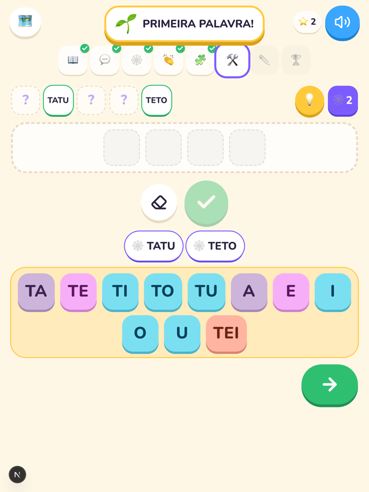
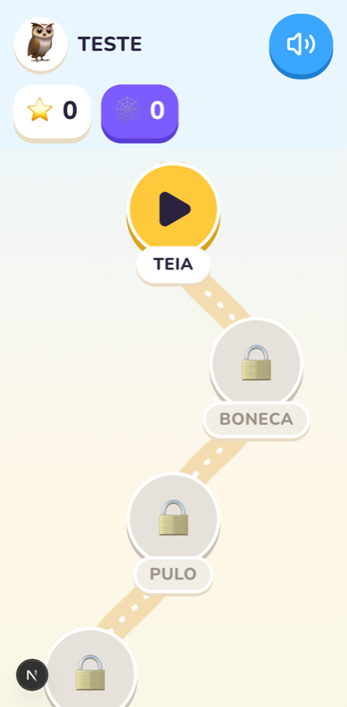
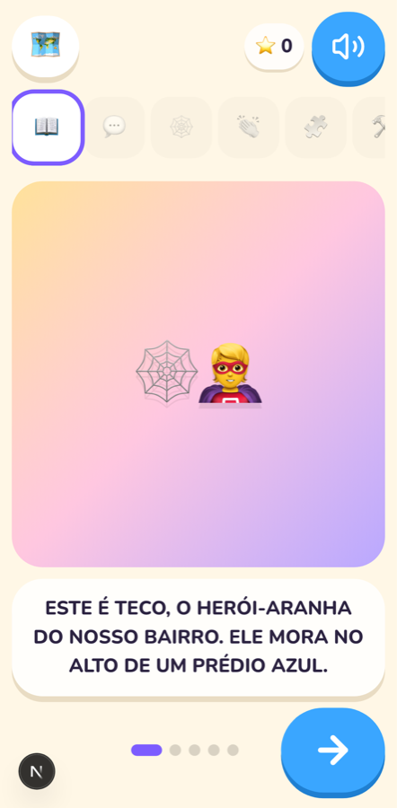
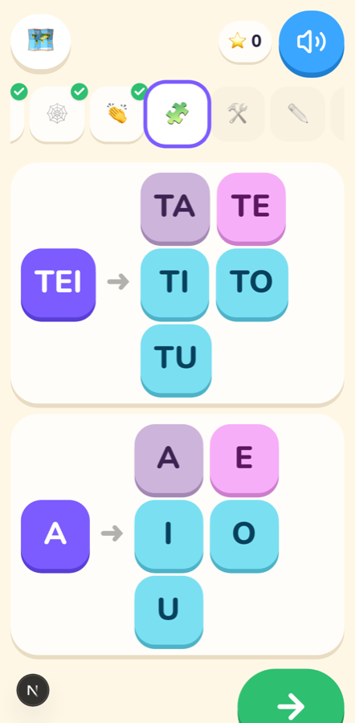
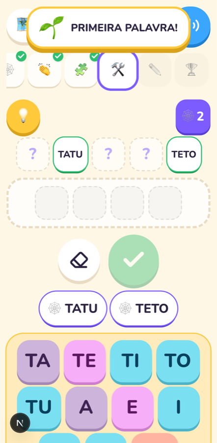
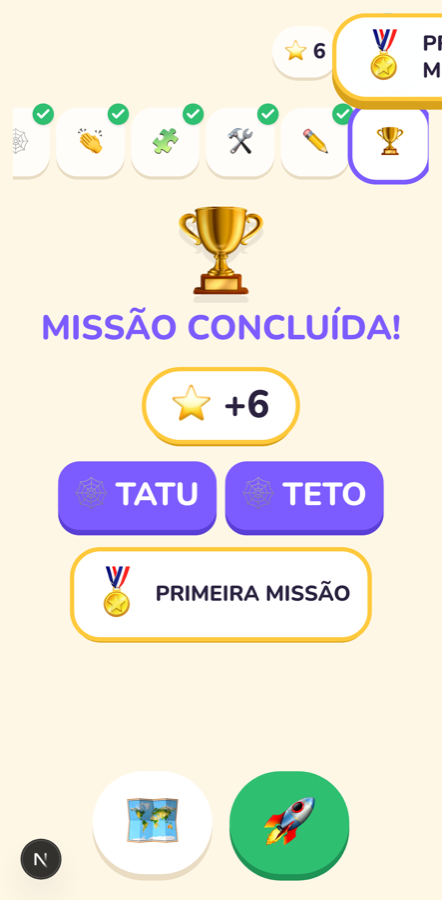
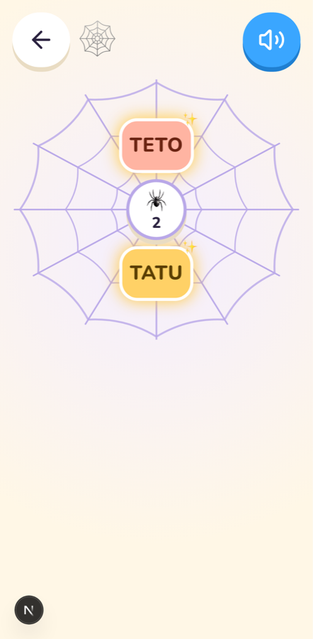

<div align="center">

# 🕸️ Teia de Palavras

**Um portal gratuito e de código aberto para alfabetizar crianças, inspirado no método de Paulo Freire.**

Cada aula é uma missão. Cada palavra descoberta vira um fio na teia da criança.

[](https://github.com/lucsghilardi/teia-de-palavras/actions/workflows/ci.yml)




</div>

---

## 💛 Por que este projeto existe

Comecei a Teia de Palavras para ajudar o meu filho a aprender a ler. Queria algo
que não tratasse a criança como alguém que "erra", e sim como alguém que
**descobre**: parte de uma palavra que faz sentido para ela, brinca com os
pedaços e percebe sozinha que consegue formar palavras novas.

Deixei o código aberto porque muitas famílias, professoras e professores estão
na mesma luta. Se ajudar mais uma criança a ler, já valeu. 🙌

## 🌱 O método, em poucas palavras

Paulo Freire alfabetizava adultos em semanas partindo de **palavras geradoras**,
palavras do dia a dia de quem aprende. O app segue o mesmo caminho, adaptado
para crianças de uns 6 anos:

1. **Uma palavra geradora por aula.** Por exemplo: `TEIA`.
2. **A palavra vira sílabas.** `TEI` · `A`, batendo palmas.
3. **Cada sílaba abre uma família.** `TE` → `TA TE TI TO TU`. É a *ficha de descoberta*.
4. **A criança combina as peças** e descobre palavras novas: `TATU`, `TETO`…
5. **As famílias se acumulam.** O que ela aprendeu na aula 1 continua na mão dela na aula 2, 3, 4…
6. **Cada palavra descoberta entra na Teia de Palavras dela.** A teia cresce junto com a leitura.

E três combinados que o sistema nunca quebra:

- ❌ **Nada de "errado", nota ou ranking.** Tentativa que não forma palavra ganha uma dica gentil; acerto ganha festa.
- 🔊 **Tudo fala.** Cada toque tem áudio, porque quem ainda não lê precisa ouvir.
- 🔒 **Privacidade da criança em primeiro lugar.** Ela tem só apelido, avatar e turma (mais detalhes em [Privacidade](#-privacidade-e-lgpd)).

## 🎮 Como é uma aula

Cada missão tem uma história com um herói do bairro e uma fábrica de
brinquedos, e passa por 8 etapas:

| # | Etapa | O que a criança faz |
|---|---|---|
| 1 | 📖 **Missão** | Ouve (e vê) a história que apresenta a palavra |
| 2 | 💬 **Conversa** | Responde perguntas sobre a história, como num círculo de cultura |
| 3 | 🕸️ **Palavra** | Conhece a palavra geradora escrita e falada |
| 4 | 👏 **Palmas** | Separa a palavra em sílabas batendo palmas |
| 5 | 🧩 **Ficha** | Explora as famílias silábicas (TA TE TI TO TU) |
| 6 | 🛠️ **Criação** | Junta sílabas para inventar palavras; as que existem vão para a Teia |
| 7 | ✏️ **Produção** | Monta uma frase com as palavras da própria Teia |
| 8 | 🏆 **Conquista** | Comemora: estrelas, palavras novas e medalhas |

<table>
  <tr>
    <td align="center"><br><sub>Mapa de missões</sub></td>
    <td align="center"><br><sub>A história</sub></td>
    <td align="center"><br><sub>Ficha de descoberta</sub></td>
  </tr>
  <tr>
    <td align="center"><br><sub>Criação de palavras</sub></td>
    <td align="center"><br><sub>Conquista</sub></td>
    <td align="center"><br><sub>A Teia da criança</sub></td>
  </tr>
</table>

### Missões que já vêm prontas

O banco de dados inicial traz 10 missões. As 5 primeiras já estão publicadas e
as outras ficam como rascunho para o educador revisar e publicar no painel:

| Fase 1 (publicadas) | Fase 2 (rascunho) |
|---|---|
| 1. A teia do bairro: **TEIA** | 6. A aranha do telhado: **ARANHA** |
| 2. A boneca perdida: **BONECA** | 7. O que faz um herói?: **HERÓI** |
| 3. O pulo certeiro: **PULO** | 8. Os segredos da fábrica: **FÁBRICA** |
| 4. A mola do robô: **MOLA** | 9. A máscara misteriosa: **MÁSCARA** |
| 5. Juntos salvamos a vila: **SALVA** | 10. O brinquedo esquecido: **BRINQUEDO** |

O nome do herói e da fábrica é configurável, e as histórias se adaptam a ele.

## ✨ O que já funciona

**App da criança** (tablet ou celular)
- Entrada sem senha: o adulto digita o código da turma (ou lê o QR code), a criança toca no próprio avatar e na sua "figura secreta"
- Mapa de missões, as 8 etapas completas, Teia de Palavras, estrelas, sequência de dias e medalhas
- Voz em tudo: usa o áudio gravado quando existe e, se não, a voz do próprio navegador em português
- Botões grandes (≥ 64 px), letras em caixa alta na Fase 1, respeita "reduzir movimento" do aparelho
- Sugere uma pausa depois de alguns minutos de tela

**Painel do educador** (pai, mãe ou professora)
- Turmas com código e QR code, cadastro de crianças
- Editor de aulas: história, perguntas, sílabas, famílias e palavras-meta
- Dicionário de palavras válidas, avatares, figuras e configurações

## 🚀 Como rodar

Você precisa de [Docker](https://www.docker.com/products/docker-desktop/) instalado. O resto roda dentro dos containers.

```bash
git clone https://github.com/lucsghilardi/teia-de-palavras.git
cd teia-de-palavras

cp backend/laravel/.env.example backend/laravel/.env   # preencha ADMIN_*, REVERB_* (veja os comentários no arquivo)
cp frontend/.env.example frontend/.env                 # NEXT_PUBLIC_REVERB_APP_KEY = REVERB_APP_KEY do backend

docker compose up -d --build
docker compose exec backend php artisan key:generate
docker compose exec backend php artisan jwt:secret
docker compose exec backend php artisan migrate
docker compose exec backend php artisan storage:link
docker compose exec backend php artisan db:seed        # avatares, configurações, dicionário e as 10 missões
```

O administrador inicial é criado pela migration a partir de `ADMIN_NAME`,
`ADMIN_EMAIL` e `ADMIN_PASSWORD` (mínimo 12 caracteres).

Em ambiente `local`, o seed também cria a turma **Casa** com a criança de teste
**Explorador** (avatar raposa, figura secreta estrela). O código da turma aparece
no fim do seed e na tela Turmas.

| Serviço | Endereço |
|---|---|
| Painel do educador | http://localhost:3005 |
| App da criança | http://localhost:3005/app/entrar |
| API (Laravel) | http://localhost:8005/api |
| Reverb (WebSocket) | ws://localhost:8085 |
| PostgreSQL | 127.0.0.1:5437 |

**Primeira aula:** entre no painel, confira a turma **Casa**, abra
`/app/entrar` no tablet, digite o código da turma e deixe a criança escolher o
avatar e a figura secreta. Pronto. 🎉

## 🧱 Tecnologia

| Camada | Tecnologia |
|---|---|
| API | Laravel 12, PHP 8.3, PostgreSQL 16, JWT (`tymon/jwt-auth`) com dois guards (`api` para adultos, `crianca` para crianças), Laravel Reverb |
| Front | Next.js 16 (App Router), React 19, TypeScript, Tailwind 4, shadcn/ui |
| Testes | Pest (backend), Vitest e Playwright (front) |
| Infra | Docker Compose (dev e prod), GitHub Actions |

O navegador nunca vê o token: ele fica num cookie httpOnly e um proxy no Next
injeta o `Bearer` e renova a sessão sozinho.

```
backend/laravel      API Laravel (routes/api/{auth,painel,crianca,turma}.php, regras em app/Services)
backend/nginx|php    nginx e php.ini das imagens
frontend             Next.js: app/(painel) para o educador, app/(crianca) para a criança
                     lib/aula tem o "motor" da aula (lógica pura, testada com Vitest)
deploy               scripts e init do PostgreSQL
docs                 contratos da API e imagens
```

Os contratos da API ficam em [`docs/api-painel.md`](docs/api-painel.md),
[`docs/api-crianca.md`](docs/api-crianca.md) e [`docs/api-roda.md`](docs/api-roda.md).

## 🧪 Testes

```bash
docker compose exec backend php artisan test   # backend (Pest), banco teia_test
cd frontend && npm test                        # lógica do app da criança (Vitest)
cd frontend && npm run test:e2e                # missão TEIA de ponta a ponta, só com toques, em tablet e celular (Playwright)
```

- Os testes do backend usam o PostgreSQL do compose (banco `teia_test`, criado na
  primeira subida do volume). Fora do Docker: `DB_HOST=127.0.0.1 DB_PORT=5437 php artisan test`.
- O E2E precisa do ambiente de desenvolvimento no ar. Antes de cada teste ele
  recria a turma `E2ETST` com a criança "Teste" (`php artisan teia:preparar-e2e`),
  sem mexer nas outras turmas. Na primeira vez, rode `npx playwright install chromium`.
- Com `E2E_CAPTURAS=1 npm run test:e2e`, uma imagem de cada tela vai para
  `frontend/test-results/capturas`. As imagens deste README saíram daí.

## 🔒 Privacidade e LGPD

- A criança tem **só apelido, avatar e turma**. Nada de nome completo, foto ou data de nascimento.
- Quem cadastra é o responsável, com consentimento registrado.
- A criança entra com uma figura secreta, não com senha. Depois de 5 tentativas, a entrada pausa por 15 minutos e o app pede ajuda a um adulto.
- Áudios ficam em disco privado, nunca em pasta pública.

## 🗺️ Próximos passos

- [x] **Fase 0–1:** estrutura, modelagem, conteúdo inicial e editor de aulas
- [x] **Fase 2:** aula individual completa (8 etapas) e Teia de Palavras
- [ ] **Fase 3:** *Roda*, o modo turma em tempo real: educador no projetor, criança-mestre e duplas (contrato pronto em `docs/api-roda.md`)
- [ ] **Fase 4:** gravação e aprovação de áudios, sugestão de palavras pelas crianças
- [ ] **Fase 5:** painel de progresso, acessibilidade e deploy
- [ ] **Depois:** desafios sem nota (as "provas" do jeito Teia)

## 🤝 Quer ajudar?

Toda ajuda é bem-vinda, e não precisa ser código:

- **Educadores e pedagogas:** sugestões de palavras geradoras, histórias e perguntas para as missões
- **Pais e mães:** contem como foi usar com seus filhos, o que funcionou e o que travou
- **Devs:** abram uma issue ou um pull request. Antes de mexer, leiam o [`CLAUDE.md`](CLAUDE.md), que tem as regras de negócio que não podem ser quebradas
- **Ilustradores e dubladores:** imagens e áudios para as histórias deixariam tudo ainda mais bonito

Se este projeto te ajudou, deixe uma ⭐. Isso ajuda outras famílias a encontrá-lo.

---

<div align="center">
<sub>Feito com carinho por um pai que quer ver o filho lendo o mundo. 📚</sub><br>
<sub><i>"A leitura do mundo precede a leitura da palavra."</i> (Paulo Freire)</sub>
</div>
